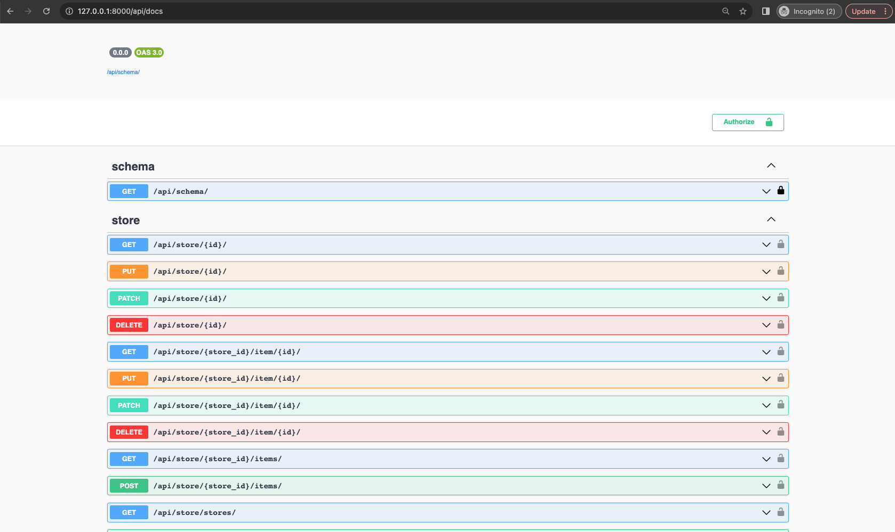
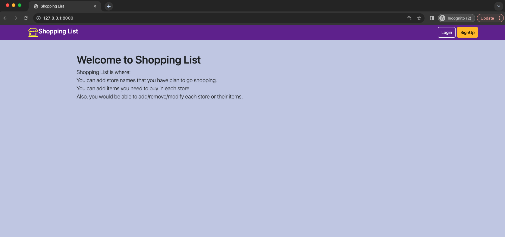
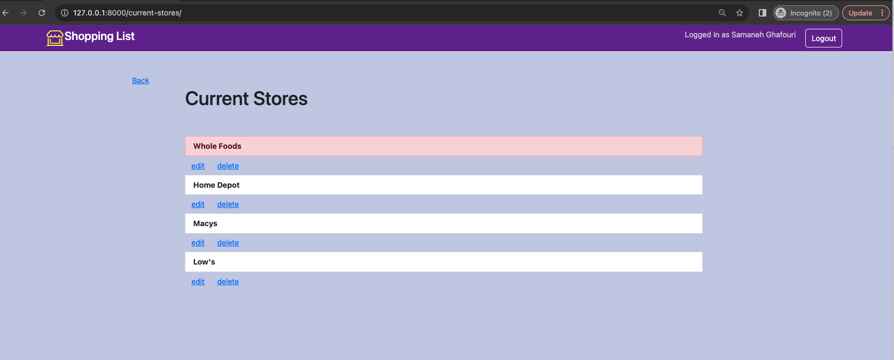
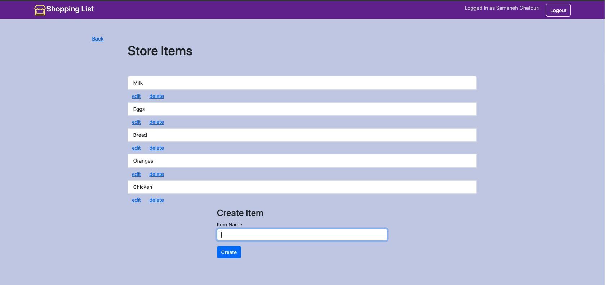

# About Shopping List

This app will allow you to create a shopping lists for each of the stores that you visit. You will be able to add, edit and delete both stores and shopping list items. To get started, simply create a free account. Enjoy!

# Shopping List Tech Stack

Shopping List is built with the `django` full-stack framework. You may use this app with the provided front-end or, if you prefer, you may use our RESTful backend api service to create your shopping list. The backend was built using the popular `Django Reset Framework`. The entire tech stack is containerized with Docker.

# Project Flow
* Back-end: All endpoints are documented using `swagger`, and can be found at `http://127.0.0.1:8000/api/docs` after running the project.
  * app/app/core: includes User, Store, and Item models, also tests for models.
  * app/app/user: includes User API, and tests for User API.
  * app/app/Store: includes Store, Item APIs, and tests for Store and Item APIs.

* Front-end: gets the user's stores and shopping list by making network calls to the defined endpoints.
    * app/shoppinglist: includes api_calls.py(network calls to the back end), views and urls for the front-end.

# Requirements to Run
Since the project is containerized with Docker all you need is to:
1. Have [Docker](https://docs.docker.com/desktop/) installed on your machine.
2. Add `.env` file to the root of your project and add appropriate values. You can find the sample of env at `.env.sample`. Note: You can copy/paste URL from `.env.sample` to `.env`. This is the url we need for network calls in app/shopping/api_calls.py.
3. Run `docker build .` to build the project
4. Run `docker-compose up` You should be able to see the project running at `http://127.0.0.1:8000/` or `http://localhost:8000/`.
5. If you want to create a `Django` Admin: In your terminal run `docker-compose run --rm app sh -c "python manage.py createsuperuser"` then enter username and password. Then you can login as an admin here `http://127.0.0.1:8000/admin'
6. To run all tests: `docker-compose run --rm app sh -c "python manage.py test"`

# Screenshots

